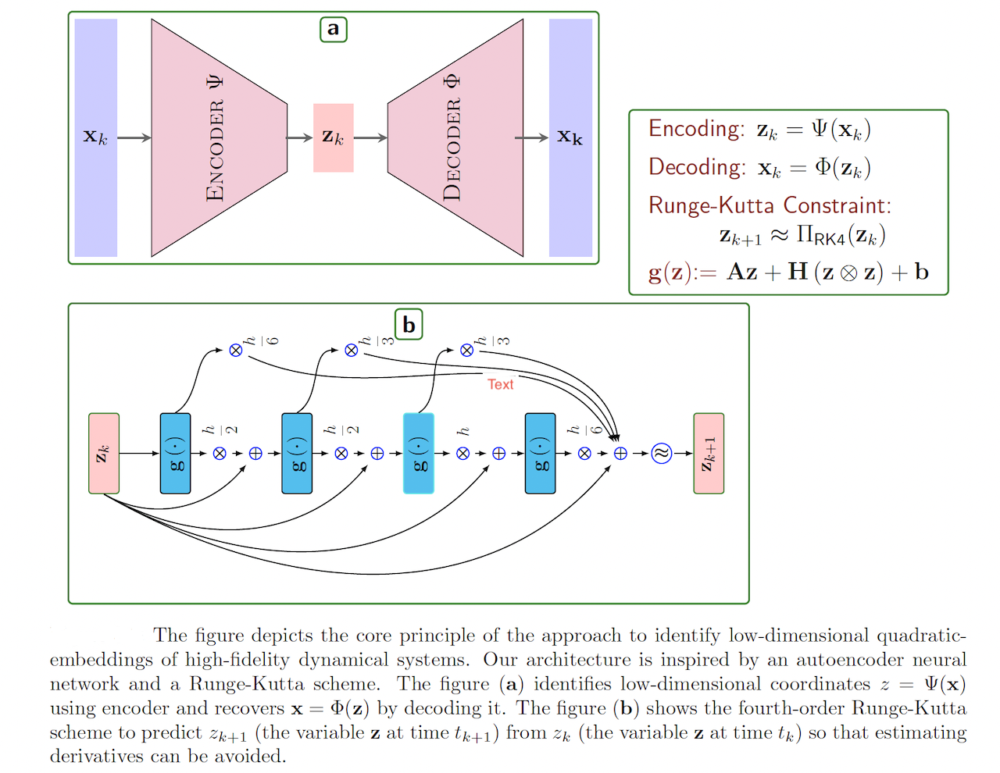

# Learning Low-dimensional Quadratic Embeddings of High-fidelity Nonlinear Dynamics using Deep Learning

This repository contains the Python implementation using the PyTorch framework to Learning Low-dimensional Quadratic Embeddings of High-fidelity Nonlinear Dynamics using Deep Learning [1]. The methodology is depicted in the figure below.

<p align="center">

</p>
     
The method combines the principle of autoencoder with a Runge-Kutta scheme to learn low-dimensional quadratic embeddings for high-fidelity complex dynamic data.

The important steps of the methodology are:

1. Collect measurement data  
2. Define encoder, decoder, and a quadratic models with user-defined embedding dimensions
3. Train the networks simultaneously using the loss function
 	
We utilize automatic differentiation implemented in PyTorch. 

## Contains
* `Functions` contains externalized Python routines, e.g., training and loading data
* `Examples` contains all the examples presented in the paper [1]. 

## Reproducibility 
To reproduce all the results in the paper [1], please run `Example_Burgers2D.py ` and `Example_Tubular.py` in the folder `Examples`. One may run the corresponding jupyter notebooks as well. All the results will be saved in the folder `.\Examples\logs\`.

## Dependencies
For reproducibility, we have stored all dependencies and their versions in `environment.yml`. A virtual environment, namely `Quad_embeds` can be created using `conda`:
 
 ```
 conda env create -f environment.yml
 conda activate Quad_embeds
 ``` 

## License
See the [LICENSE](LICENSE) file for license rights and limitations (MIT). 

## References
[1]. P. Goyal, and P. Benner, [Learning low-dimensional quadratic embeddings of high-fidelity nonlinear dynamics using deep learning](https://arxiv.org/abs/2111.12995), arXiv preprint, arXiv:2111.12995, 2021.

[2]. B. Peherstorfer and K. Willcox, [Data-driven operator inference for nonintrusive projection-based model reduction](https://www.sciencedirect.com/science/article/pii/S0045782516301104), Comp. Meth. Appl. Mech. Eng., vol. 306, pp. 196–215, 2016.

[3]. P., Adam et al., [PyTorch: An imperative style, high-performance deep learning library](http://papers.neurips.cc/paper/9015-pytorch-an-imperative-style-high-performance-deep-learning-library.pdf). Advances in Neural Information Processing Systems, pp. 8024--8035, 2019.

## Contact
For further queries, please contact [Pawan Goyal](mailto:goyalp@mpi-magdeburg.mpg.de). 


